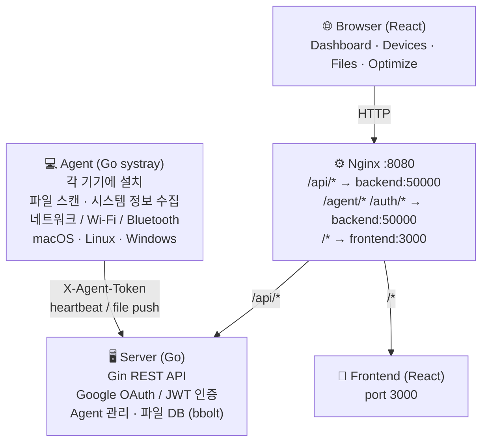

# Maxie

여러 기기의 파일을 중앙에서 관리하고 최적화하는 도구입니다.  
각 기기에 설치된 **Agent**가 파일·시스템 정보를 수집해 서버로 전송하고, **웹 대시보드**에서 통합 관리합니다.

---

## 구성



### 컴포넌트

| 디렉터리 | 역할 |
|----------|------|
| `server/` | Go + Gin 백엔드. 인증, Agent 등록·heartbeat, 파일 DB 관리 |
| `web/` | React 프론트엔드. 대시보드, 기기 관리, 다운로드 페이지 |
| `agent/` | Go systray Agent. 파일 스캔, 시스템·네트워크 정보 수집 |
| `nginx/` | 리버스 프록시. 웹·API·Agent 경로 분리 |

---

## 빠른 시작

### 1. 환경 변수 설정

```bash
cp .env.example .env
```

`.env` 파일을 열어 값을 채웁니다.

```env
# 외부 접속 주소 (브라우저 기준)
CORS_ALLOW_ORIGIN=http://localhost:8080

# 노출 포트
EXPOSE_PORT=8080

# HTTPS 도메인 운영 시만 설정 (로컬은 비워두기)
COOKIE_DOMAIN=

# Agent 다운로드 URL (기본값 그대로 사용 가능)
REACT_APP_AGENT_RELEASE_BASE_URL=https://github.com/hwan001/fileoptimizer/releases/latest/download

# Google OAuth — 비워두면 Guest 로그인만 사용 가능
REACT_APP_GOOGLE_CLIENT_ID=
GOOGLE_CLIENT_ID=
GOOGLE_CLIENT_SECRET=
REDIRECT_URI=http://localhost:8080

# 세션 서명 키 — 운영 배포 시 반드시 변경
JWT_SECRET=dev-jwt-secret-change-me
```

### 2. 실행

```bash
docker compose up -d --build
```

브라우저에서 `http://localhost:8080` 접속.

---

## 환경 변수 상세

| 변수 | 기본값 | 설명 |
|------|--------|------|
| `CORS_ALLOW_ORIGIN` | `http://localhost:8080` | 브라우저가 접속하는 origin (서버 CORS 설정) |
| `EXPOSE_PORT` | `8080` | 외부에 노출할 포트 |
| `COOKIE_DOMAIN` | (없음) | HTTPS 도메인 배포 시 설정. 로컬은 비워둠 |
| `REACT_APP_AGENT_RELEASE_BASE_URL` | GitHub Releases URL | Agent 다운로드 버튼이 사용하는 베이스 URL |
| `REACT_APP_GOOGLE_CLIENT_ID` | (없음) | 웹 빌드 시 주입되는 Google Client ID |
| `GOOGLE_CLIENT_ID` | (없음) | 서버 OAuth 검증용 Client ID |
| `GOOGLE_CLIENT_SECRET` | (없음) | 서버 토큰 교환용 Secret |
| `REDIRECT_URI` | `http://localhost:8080` | Google Console에 등록한 리디렉션 URI와 **정확히 일치** 필요 |
| `JWT_SECRET` | `dev-jwt-secret-change-me` | JWT 서명 키. **운영 배포 전 반드시 교체** |

> Google 로그인 없이도 **Guest 로그인**으로 Agent 등록·파일 관리 기능을 모두 사용할 수 있습니다.

---

## Agent

### 다운로드

웹 대시보드 → **Download Agent** 섹션에서 OS에 맞는 바이너리를 다운로드합니다.

| 플랫폼 | 파일명 |
|--------|--------|
| macOS (Apple Silicon / Intel Universal) | `fileoptimizer-agent-darwin` |
| Linux amd64 | `fileoptimizer-agent-linux-amd64` |
| Linux arm64 | `fileoptimizer-agent-linux-arm64` |
| Windows amd64 | `fileoptimizer-agent-windows-amd64.exe` |

### 설치 및 실행

**macOS / Linux**

```bash
chmod +x fileoptimizer-agent-darwin   # 또는 -linux-amd64 등
./fileoptimizer-agent-darwin
```

> macOS: 처음 실행 시 *개인 정보 보호 및 보안* → *허용* 클릭 필요

**Windows**

`fileoptimizer-agent-windows-amd64.exe` 더블클릭.

실행 후 시스템 트레이 아이콘이 표시되면 서버 주소를 입력해 등록합니다.

### 동작 방식

1. 최초 실행 시 서버에 등록 → `agent_id` + `X-Agent-Token` 발급
2. 설정된 드라이브를 주기적으로 스캔, 파일 해시·메타데이터를 서버로 전송
3. 시스템 정보 (CPU, 네트워크, Wi-Fi, Bluetooth) 수집 및 heartbeat 전송
4. 서버에서 전달된 pending action 처리

---

## 빌드 및 배포

### Agent 빌드 (Makefile)

```bash
make all          # macOS Universal + Linux amd64/arm64 + Windows
                  # Linux 빌드는 Docker 필요
                  # → dist/agents/ 에 바이너리 생성

make local        # macOS + Windows (Docker 없이 빌드 가능)
make darwin-universal
make linux-amd64
make linux-arm64
make windows

make deploy       # make all 후 docker compose up -d --build
make clean        # dist/ 삭제
```

빌드 결과물:

```
dist/
└── agents/
    ├── fileoptimizer-agent-darwin
    ├── fileoptimizer-agent-linux-amd64
    ├── fileoptimizer-agent-linux-arm64
    └── fileoptimizer-agent-windows-amd64.exe
```

**플랫폼별 CGO 요구사항**

| 플랫폼 | CGO | 비고 |
|--------|-----|------|
| macOS (arm64/amd64) | 필요 | Cocoa 바인딩 |
| Linux amd64/arm64 | 필요 | GTK3 바인딩 — Docker 사용 |
| Windows amd64 | 불필요 | 순수 Go, macOS에서 크로스 컴파일 가능 |

### GitHub Releases (자동 배포)

태그를 push하면 GitHub Actions가 모든 플랫폼 바이너리를 빌드해 Release에 첨부합니다.

```bash
git tag v1.0.0
git push origin v1.0.0
```

### 운영 서버 배포 (HTTPS)

`docker-compose.prod.yml` 사용:

```bash
GOOGLE_CLIENT_ID=... GOOGLE_CLIENT_SECRET=... JWT_SECRET=... \
  docker compose -f docker-compose.prod.yml up -d --build
```

---

## 개발 환경

### Go 버전 관리 (goenv)

```bash
git clone https://github.com/syndbg/goenv.git ~/.goenv

# ~/.bashrc 또는 ~/.zshrc 추가
export GOENV_ROOT="$HOME/.goenv"
export PATH="$GOENV_ROOT/bin:$PATH"
eval "$(goenv init -)"

source ~/.bashrc
goenv install 1.25.0
goenv global 1.25.0
```

### 서버 로컬 실행

```bash
cd server && go run .
```

### 프론트엔드 로컬 실행

```bash
cd web && npm install && npm start
```
